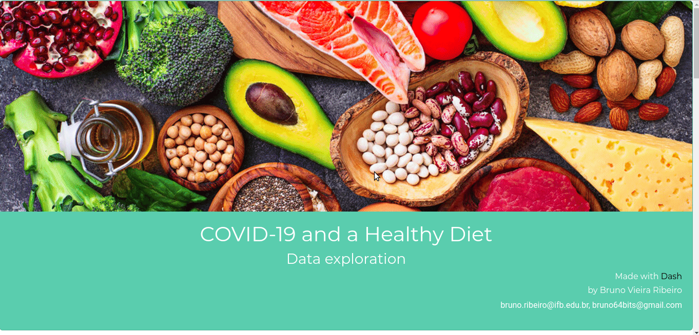
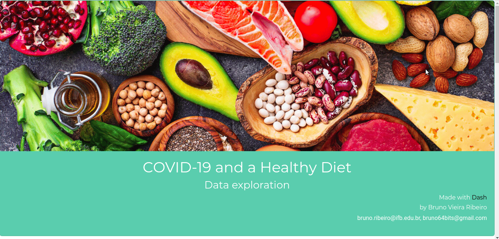

# Project Healthy Diet against COVID-19

## General description

In this project, I use data *from food intake by countries* along with data associated with the *spread of COVID-19 and other health issues* to help get new insights into the importance of nutrition and eating habits to combat spreading diseases.

Data for this project is taken from [this](https://www.kaggle.com/mariaren/covid19-healthy-diet-dataset) very interesting kaggle dataset. From the owner of the dataset:

> In this dataset, I have combined data of different types of food, world population obesity and undernourished rate, and global COVID-19 cases count from around the world in order to learn more about how a healthy eating style could help combat the Corona Virus. And from the dataset, we can gather information regarding diet patterns from countries with lower COVID infection rate, and adjust our own diet accordingly

There are 5 files in the dataset:
* Fat_Supply_Quantity_Data.csv: percentage of fat intake from different food groups for 170 different countries.
* Food_Supply_Quantity_kg_Data.csv: percentage of food intake( in $kg$ ) from different food groups for 170 different countries.
* Food_Supply_kcal_Data.csv: percentage of energy intake (in $kcal$) from different food groups for 170 different countries.
* Protein_Supply_Quantity_Data.csv: percentage of protein intake from different food groups for 170 different countries.
    * All of these files have, also, columns including obesity, undernourishment and COVID-19 cases as percentages of total population.
* Supply_Food_Data_Descriptions.csv: This dataset is obtained from FAO.org, and is used to show the specific types of food that belongs to each category for the above datasets.

I use kaggle's api to grab these files and save them in a `data` folder.

## The notebook

The notebook `projectHealthy.ipynb` includes EDA and some modeling.

In this notebook I tried to explore possible patterns found in data of COVID-19 and food intake in different countries. One major goal was to find the influence of obesity rates in the effect of the disease in each country. Splitting countries into HOC and LOC groups, it was possible to create a classifier, with good accuracy, predicting in which group would a country be based on its food intake data.

Having this, we created regression models to try to predict the `Mortality` of COVID-19 in countries based on ther eating habits and obesity rate. Two approaches were taken: one with all food related features taken as parameters and a simpler one. Both have issues (mainly of spread and non-linearity), but we could show use of different models and metrics.

Next, we build a model to predict `Obesity` rates based on eating habits in each country. This model was far more succesfull and the overall tendency of the data was captured and predicted.

Finally, we build a quick helper function to do some clustering based on pairs of features.

## Dash app
For a more visual data exploration, I have built simple dashboards to do some EDA with Dash:
- [App1](https://healthycovid19app1.herokuapp.com/)
- [App2](https://healthycovid19app2.herokuapp.com/)
- [App3](https://healthycovid19app3.herokuapp.com/)

The app was split into 3 to avoid long processes errors in Heroku deployment.

Code for the dash app can be found inside the `dashboard` folder.

*Example usage of dash app1.*

*Example usage of dash app2.*

*Example usage of dash app3.*

Comments are very welcome!

Stay safe everyone!
